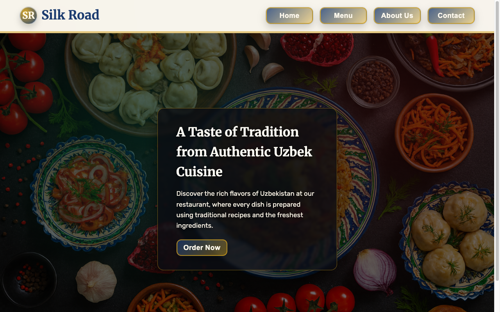

# Restaurant Page

A single-page restaurant site with tab-style navigation that swaps content without a
page reload — built to practice **DOM manipulation and module bundling with Webpack**.

🔗 **Live demo:** [restaurant-two-plum.vercel.app](https://restaurant-two-plum.vercel.app/)



## Features

- Module-driven Home, Menu, About, and Contact sections.
- Tabbed navigation that swaps page content with no full reload.
- Menu rendering backed by real food imagery.
- Contact rows for location, phone, email, social, and hours.

## Tech stack

JavaScript (ES modules) · HTML · CSS · **Webpack**

## Getting started

```bash
npm install
npm start        # webpack dev server (opens the browser)
npm run build    # production bundle
```

## What I practiced

Generating UI **entirely from JavaScript modules**, organizing a page into importable
sections, and using Webpack to bundle modular code and static assets.

## License

Odin Project coursework — original implementation by Aziz Umarov.
